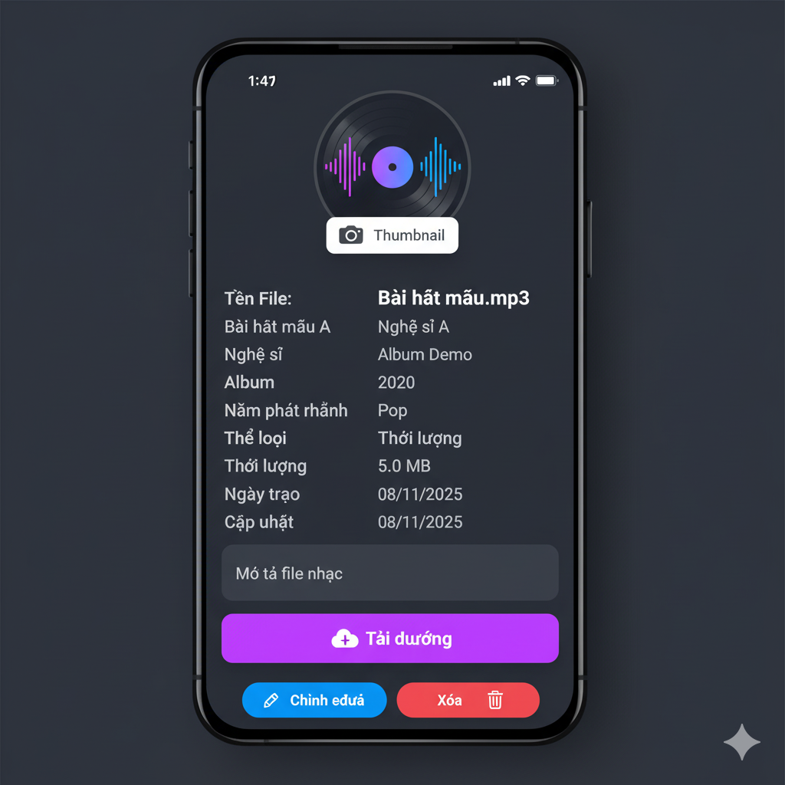
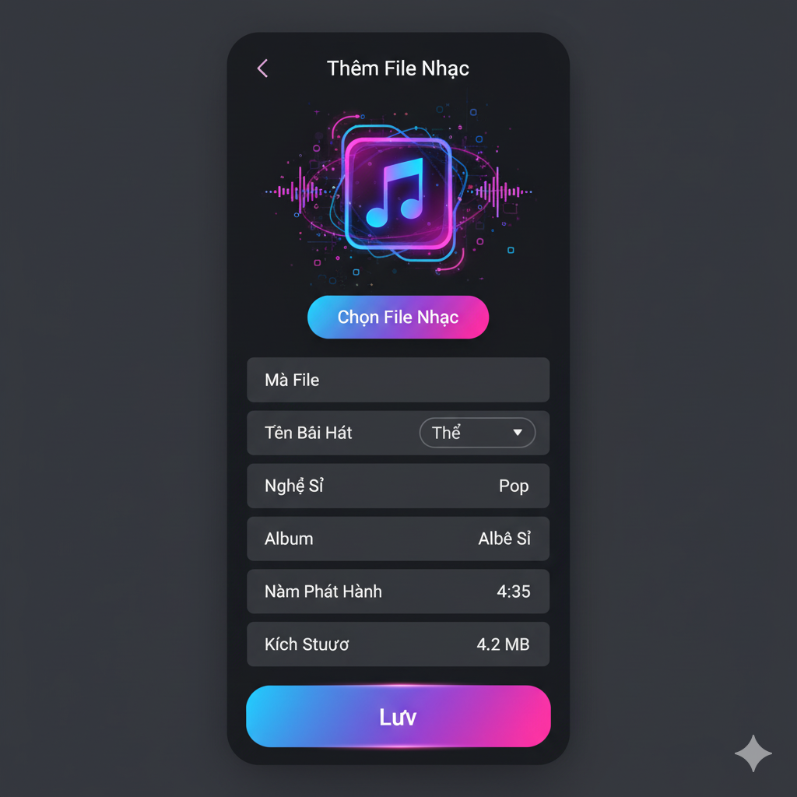
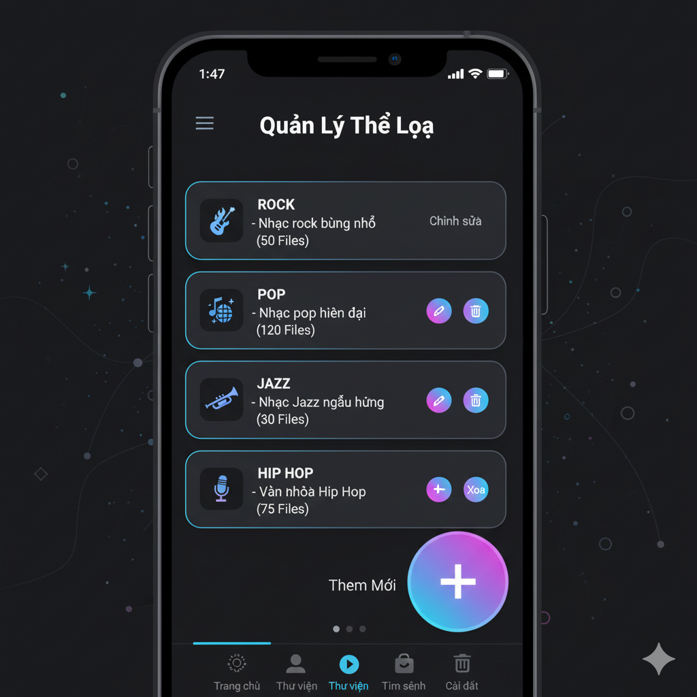
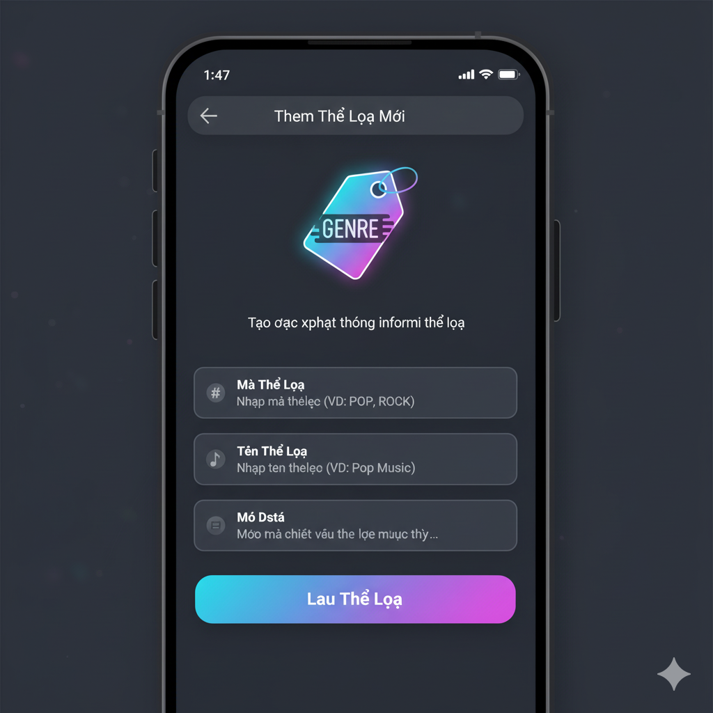
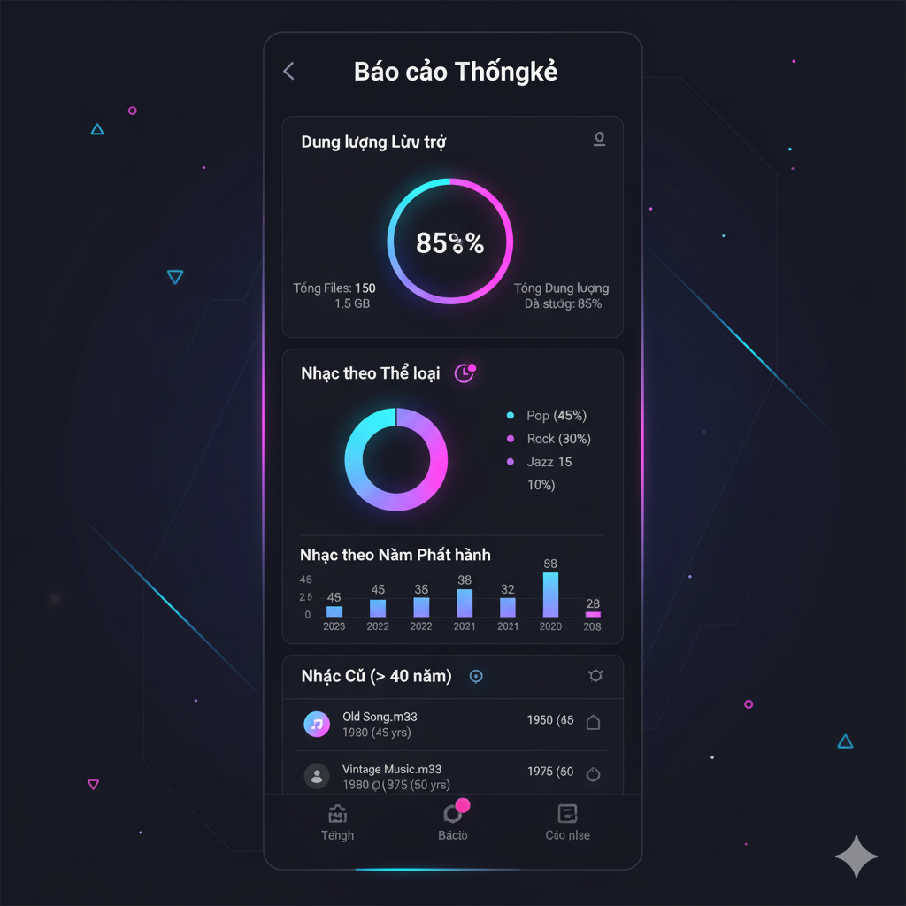

 thiết kế giao diện ứng dụng di động cho hệ thống quản lý file nhạc, tập trung vào các chức năng chính mà API cung cấp:

 Cấu trúc chung của ứng dụng
Ứng dụng sẽ có một thanh điều hướng dưới cùng (Bottom Navigation Bar) với các tab chính:
Trang chủ (Home): Hiển thị các file nhạc nổi bật, gần đây, hoặc gợi ý.
Thư viện (Library): Quản lý tất cả file nhạc, thể loại.
Tìm kiếm (Search): Tìm kiếm và lọc nhạc.
Báo cáo (Reports): Xem các báo cáo thống kê.
Cài đặt (Settings): Các tùy chọn ứng dụng.

Thiết kế chi tiết các màn hình theo API
1. Nhóm API "Music Files" (Quản lý File nhạc)
Màn hình chính: Thư viện nhạc (Music Library)
Mục đích: Hiển thị danh sách tất cả các file nhạc. Hỗ trợ phân trang, tìm kiếm và lọc.
UI Elements:
Thanh tìm kiếm (Search Bar): Cho phép người dùng nhập từ khóa để tìm kiếm (Search Music Files).
Bộ lọc (Filter Button): Mở một modal hoặc màn hình riêng để lọc theo Thể loại (Genre), Loại file (File Type), Nghệ sĩ (Artist), Năm phát hành (Release Year). Các API tương ứng: Filter by Genre, Filter by File Type, Filter by Artist, Filter by Release Year.
Danh sách nhạc (Music List): Hiển thị các bài hát dưới dạng danh sách hoặc lưới. Mỗi item sẽ bao gồm:
Thumbnail của bài hát (nếu có)
Tên bài hát (fileName)
Nghệ sĩ (artist)
Thể loại (genreName)
Thời lượng (duration)
Nút thêm mới (Floating Action Button - FAB): Nút "+" ở góc màn hình để thêm file nhạc mới.
Tải lại/Phân trang: Cuộn xuống để tải thêm (lazy loading) hoặc kéo xuống để làm mới.

API sử dụng:
Get All Music Files (Paginated): Lấy danh sách ban đầu.
Search Music Files: Khi người dùng nhập từ khóa.
Filter by Genre, Filter by File Type, Filter by Artist, Filter by Release Year: Khi người dùng áp dụng bộ lọc.
Màn hình chi tiết file nhạc (Music File Detail)
Mục đích: Hiển thị thông tin chi tiết của một file nhạc và cho phép chỉnh sửa, tải lên thumbnail hoặc xóa.
UI Elements:
Ảnh thumbnail: Hiển thị thumbnail của bài hát, có nút "Thay đổi" hoặc biểu tượng camera để Upload Thumbnail.
Thông tin bài hát:
Tên file (fileName)
Nghệ sĩ (artist)
Album (album)
Năm phát hành (releaseYear)
Thể loại (genreName)
Mô tả (description)
Thời lượng (duration)
Kích thước file (fileSize)
Ngày tạo (createdAt), Ngày cập nhật (updatedAt)
Nút Download: Để tải file nhạc về (downloadLink).
Nút chỉnh sửa (Edit Button): Chuyển sang màn hình "Chỉnh sửa file nhạc" (Update Music File).
Nút xóa (Delete Button): Xóa file nhạc (Delete Music File).

API sử dụng:
Get Music File by ID hoặc Get Music File by Code: Lấy dữ liệu hiển thị.
Upload Thumbnail: Khi người dùng thay đổi thumbnail.
Update Music File: Khi người dùng lưu thay đổi.
Delete Music File: Khi người dùng xác nhận xóa.
Màn hình thêm/chỉnh sửa file nhạc (Add/Edit Music File)
Mục đích: Cho phép người dùng nhập thông tin để tạo mới hoặc cập nhật một file nhạc.
UI Elements:
Form nhập liệu:
Trường nhập File Code (text input)
Trường nhập File Name (text input)
Dropdown chọn Genre (dựa trên API Get All Genres hoặc Get Genre by ID)
Trường nhập Artist (text input)
Trường nhập Album (text input)
Trường nhập Release Year (number input)
Trường nhập Description (multiline text input)
Trường nhập Duration (number input, có thể tự động điền nếu upload file)
Trường nhập File Size (number input, có thể tự động điền nếu upload file)
Nút "Chọn File Nhạc" (Upload Music File): Mở trình duyệt file để chọn file .mp3, .wav, v.v. API Upload Music File sẽ được sử dụng ở đây, kèm theo các metadata đã nhập.
Nút "Lưu" (Save Button): Gửi dữ liệu lên server. (Create Music File hoặc Update Music File).

2. Nhóm API "Music Genres" (Quản lý Thể loại nhạc)
Màn hình quản lý thể loại (Genre Management)
Mục đích: Hiển thị danh sách các thể loại nhạc và cho phép thêm, sửa, xóa.
UI Elements:
Danh sách thể loại (Genre List): Hiển thị các thể loại dưới dạng danh sách, mỗi item bao gồm:
Tên thể loại (genreName)
Mô tả (description)
Số lượng file nhạc trong thể loại (totalFiles)
Nút "Chỉnh sửa" hoặc biểu tượng bút chì.
Nút "Xóa" hoặc biểu tượng thùng rác.
Nút thêm mới (Floating Action Button - FAB): Nút "+" để thêm thể loại mới.

API sử dụng:
Get All Genres: Lấy danh sách thể loại.
Delete Genre: Khi người dùng xóa một thể loại.
Màn hình thêm/chỉnh sửa thể loại (Add/Edit Genre)
Mục đích: Cho phép người dùng nhập thông tin để tạo mới hoặc cập nhật một thể loại.
UI Elements:
Form nhập liệu:
Trường nhập Genre Code (text input)
Trường nhập Genre Name (text input)
Trường nhập Description (multiline text input)
Nút "Lưu" (Save Button): Gửi dữ liệu lên server (Create Genre hoặc Update Genre).

3. Nhóm API "Reports" (Báo cáo và Thống kê)
Màn hình báo cáo (Reports Dashboard)
Mục đích: Hiển thị tổng quan các báo cáo thống kê về file nhạc.
UI Elements:
Thẻ "Dung lượng lưu trữ" (Storage Report Card): Hiển thị totalFiles, totalStorageSize, formattedStorageSize từ Get Storage Report.
Biểu đồ/Danh sách "Nhạc theo thể loại" (Music by Genre): Sử dụng dữ liệu từ Get Report by Genre để hiển thị biểu đồ tròn hoặc biểu đồ cột, hoặc danh sách các thể loại kèm số lượng và dung lượng.
Biểu đồ/Danh sách "Nhạc theo năm" (Music by Year): Sử dụng dữ liệu từ Get Report by Year để hiển thị biểu đồ cột hoặc danh sách năm kèm số lượng bài hát.
Danh sách "Nhạc cũ" (Old Music Files): Hiển thị danh sách các bài hát cũ (Get Old Music Files). Có thể có tùy chọn để thay đổi minAge.

Các thành phần giao diện chung khác
Thông báo (Toast/Snackbar): Để hiển thị thông báo thành công, lỗi hoặc cảnh báo sau mỗi thao tác API (ví dụ: "Tạo file nhạc thành công", "Xóa thể loại thất bại").
Loading Indicators: Hiển thị khi đang chờ phản hồi từ API.
Modal xác nhận: Trước khi xóa một file nhạc hoặc thể loại.
Menu Hamburger (nếu cần): Để truy cập các tính năng phụ hoặc cài đặt.